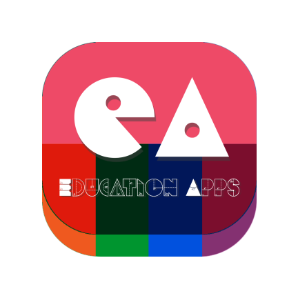

# EDU APP
<div align="center">
  <a href="https://github.com/orgs/TIMESYNC-Project/repositories">
    
  </a>

  <p align="center">
    Skripsi Program Edu App
    <br />
  </p>
</div>

## 📑 About the Project
<p align="justify">EduAPP is an application made through the data collection method stage to obtain data and information to support the improvement of the results of the research, after going through this method it enters the design stage starting from system design, interface design and system implementation and testing.
Interactive quiz learning programs can be used to train students' comprehension skills, discussion videos, and the subject matter presented.
Android-based interactive quiz learning applications can be utilized by students in working on quizzes given by the teacher using an Android-based smartphone.</p>

## 🛠 Tools
**Backend:** <br>


**Deployment:** <br>


# 🔗 Flowchart - Main Menu
(https://user-images.githubusercontent.com/121234492/219827868-1beb908b-7abc-43fb-84f7-63c2d25c2179.jpg)

# ⚡ Features

<details>
  <summary>👶 Users or Student</summary>
  
| Page      | Function                                |
| ----------- | --------------------------------------- |
| Login        | Login to the apps                 |
| Register        | Register a new user         |
| Forgot Password        | Change Password by Verify email                     |
| Bottom Navigation         | Navigates to the next menu or page display                    |
| Home Menu         | Shows several features                  |
| Tebak Gambar         | Guessing game features                   |
| Kuis         | Student quiz execution                    |
| Ranking         | Displays points all students/users                 |
| Materi      | Displays all learning materials             |
| Profile         | Display user profile and can edit profile                        |

</details>

# 🛠️ How to Run Locally

- Clone it

```
$ git clone [https://github.com/rizkysyahrir/EDU-APP]
```

- Go to directory

```
$ cd EDU-APP
```
- Run the project
```
$ go run .
```

- Voila! 🪄

# 🤖 Connecting with Me!

-  Febrian Syahrir Rizky <br>  [](https://github.com/rizkysyahrir)
[](https://www.linkedin.com/in/febrian-syahrir-rizky-9a4238166/)
[](https://www.instagram.com/rizkysyahrir/)

<h5>
<p align="center">Built with ❤️ by me ©️ 2022</p>
</h5>
